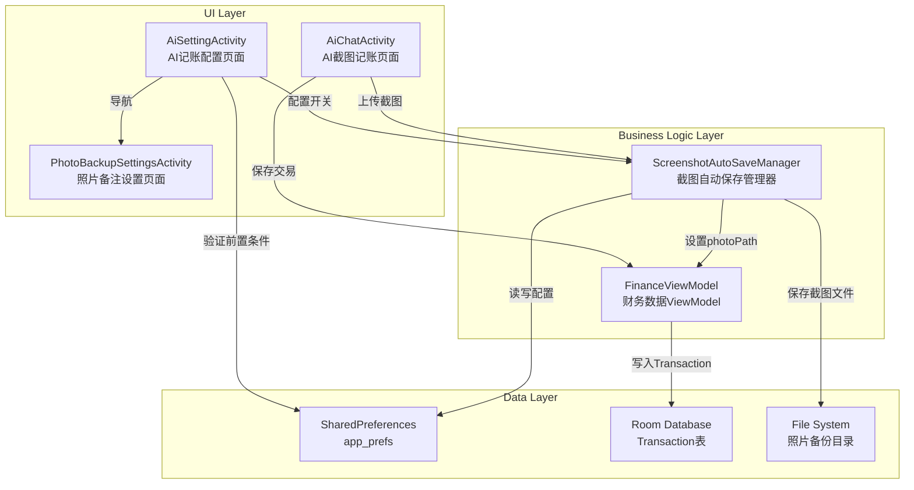
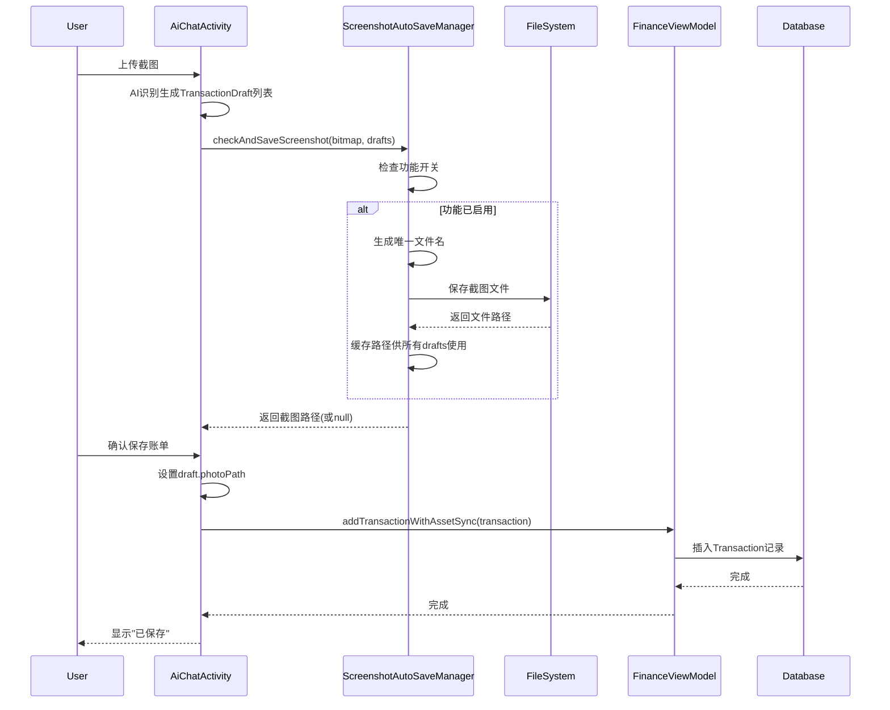

# Design Document: AI记账截图自动保存功能

## Overview

本设计文档描述了"AI记账截图自动保存"功能的技术实现方案。该功能允许用户在使用AI截图记账时，自动将截图保存到账单的照片备注中，方便用户后续查看原始账单凭证。

### 功能目标

- 在AI记账配置页面提供"保存账单截图"开关
- 验证照片备注功能的前置条件（照片备份开关和存储路径）
- 在截图记账时自动保存截图到配置的照片备份路径
- 将截图文件路径关联到生成的Transaction记录
- 支持一张截图生成多个账单的场景（共享同一截图文件）
- 妥善处理错误情况，不影响正常记账流程

### 技术栈

- **语言**: Java 8
- **UI框架**: Android原生 + Material Design Components
- **数据持久化**: SharedPreferences (配置), Room Database (Transaction实体)
- **文件存储**: Android Storage Access Framework (SAF) with DocumentFile
- **架构模式**: MVVM (ViewModel + LiveData)

## Architecture

### 系统架构图



### 数据流图



## Components and Interfaces

### 1. ScreenshotAutoSaveManager (新增组件)

**职责**: 管理截图自动保存功能的核心逻辑

**位置**: `app/src/main/java/com/example/budgetapp/util/ScreenshotAutoSaveManager.java`

**接口设计**:

```java
public class ScreenshotAutoSaveManager {
    private final Context context;
    private final SharedPreferences prefs;
    
    public ScreenshotAutoSaveManager(Context context) {
        this.context = context.getApplicationContext();
        this.prefs = context.getSharedPreferences("app_prefs", Context.MODE_PRIVATE);
    }
    
    /**
     * 检查功能是否启用
     * @return true if enabled, false otherwise
     */
    public boolean isEnabled() {
        return prefs.getBoolean("ai_screenshot_auto_save", false);
    }
    
    /**
     * 设置功能开关状态
     * @param enabled 是否启用
     */
    public void setEnabled(boolean enabled) {
        prefs.edit().putBoolean("ai_screenshot_auto_save", enabled).apply();
    }
    
    /**
     * 检查照片备份前置条件是否满足
     * @return ValidationResult 包含是否通过和错误消息
     */
    public ValidationResult validatePrerequisites() {
        boolean photoBackupEnabled = prefs.getBoolean("enable_photo_backup", false);
        if (!photoBackupEnabled) {
            return ValidationResult.error("需要先开启照片备注功能");
        }
        
        String photoBackupUri = prefs.getString("photo_backup_uri", "");
        if (photoBackupUri.isEmpty()) {
            return ValidationResult.error("需要先设置照片存储路径");
        }
        
        return ValidationResult.success();
    }
    
    /**
     * 保存截图到照片备份目录
     * @param bitmap 截图Bitmap对象
     * @return 保存成功返回文件路径，失败返回null
     */
    public String saveScreenshot(Bitmap bitmap) {
        if (!isEnabled()) {
            return null;
        }
        
        String uriString = prefs.getString("photo_backup_uri", "");
        if (uriString.isEmpty()) {
            Log.w(TAG, "Photo backup URI not configured");
            return null;
        }
        
        try {
            Uri treeUri = Uri.parse(uriString);
            DocumentFile directory = DocumentFile.fromTreeUri(context, treeUri);
            
            if (directory == null || !directory.exists() || !directory.canWrite()) {
                Log.e(TAG, "Photo backup directory not accessible");
                return null;
            }
            
            // 生成唯一文件名: screenshot_{timestamp}_{random}.jpg
            String fileName = generateUniqueFileName();
            DocumentFile imageFile = directory.createFile("image/jpeg", fileName);
            
            if (imageFile == null) {
                Log.e(TAG, "Failed to create image file");
                return null;
            }
            
            // 保存Bitmap到文件 (JPEG, 85% quality)
            try (OutputStream outputStream = context.getContentResolver().openOutputStream(imageFile.getUri())) {
                if (outputStream == null) {
                    Log.e(TAG, "Failed to open output stream");
                    return null;
                }
                bitmap.compress(Bitmap.CompressFormat.JPEG, 85, outputStream);
                outputStream.flush();
            }
            
            return imageFile.getUri().toString();
            
        } catch (Exception e) {
            Log.e(TAG, "Failed to save screenshot: " + e.getMessage(), e);
            return null;
        }
    }
    
    /**
     * 生成唯一文件名
     * @return 格式: screenshot_{timestamp}_{random}.jpg
     */
    private String generateUniqueFileName() {
        long timestamp = System.currentTimeMillis();
        int random = new Random().nextInt(10000);
        return String.format(Locale.US, "screenshot_%d_%04d.jpg", timestamp, random);
    }
    
    public static class ValidationResult {
        public final boolean isValid;
        public final String errorMessage;
        
        private ValidationResult(boolean isValid, String errorMessage) {
            this.isValid = isValid;
            this.errorMessage = errorMessage;
        }
        
        public static ValidationResult success() {
            return new ValidationResult(true, null);
        }
        
        public static ValidationResult error(String message) {
            return new ValidationResult(false, message);
        }
    }
}
```

### 2. AiSettingActivity (修改现有组件)

**修改内容**: 添加"保存账单截图"开关和前置条件验证

**新增UI元素**:
- SwitchCompat: `switchScreenshotAutoSave` - 功能开关
- TextView: `tvScreenshotAutoSaveDesc` - 功能描述文本
- TextView: `tvScreenshotAutoSaveHint` - 状态提示文本

**新增逻辑**:

```java
private SwitchCompat switchScreenshotAutoSave;
private TextView tvScreenshotAutoSaveHint;
private ScreenshotAutoSaveManager screenshotAutoSaveManager;

@Override
protected void onCreate(Bundle savedInstanceState) {
    // ... existing code ...
    screenshotAutoSaveManager = new ScreenshotAutoSaveManager(this);
    initScreenshotAutoSaveSwitch();
}

@Override
protected void onResume() {
    super.onResume();
    updateScreenshotAutoSaveHint(); // 动态更新状态提示
}

private void initScreenshotAutoSaveSwitch() {
    switchScreenshotAutoSave = findViewById(R.id.switchScreenshotAutoSave);
    tvScreenshotAutoSaveHint = findViewById(R.id.tvScreenshotAutoSaveHint);
    
    switchScreenshotAutoSave.setChecked(screenshotAutoSaveManager.isEnabled());
    updateScreenshotAutoSaveHint();
    
    switchScreenshotAutoSave.setOnCheckedChangeListener((buttonView, isChecked) -> {
        if (isChecked) {
            // 验证前置条件
            ScreenshotAutoSaveManager.ValidationResult result = 
                screenshotAutoSaveManager.validatePrerequisites();
            
            if (!result.isValid) {
                // 显示错误对话框
                showPrerequisiteDialog(result.errorMessage);
                switchScreenshotAutoSave.setChecked(false);
                return;
            }
        }
        
        screenshotAutoSaveManager.setEnabled(isChecked);
        updateScreenshotAutoSaveHint();
        Toast.makeText(this, 
            isChecked ? "已开启截图自动保存" : "已关闭截图自动保存", 
            Toast.LENGTH_SHORT).show();
    });
}

private void showPrerequisiteDialog(String message) {
    AlertDialog.Builder builder = new AlertDialog.Builder(this);
    View view = LayoutInflater.from(this).inflate(R.layout.dialog_prerequisite_check, null);
    builder.setView(view);
    AlertDialog dialog = builder.create();
    
    if (dialog.getWindow() != null) {
        dialog.getWindow().setBackgroundDrawableResource(android.R.color.transparent);
    }
    
    TextView tvMessage = view.findViewById(R.id.tv_message);
    tvMessage.setText(message);
    
    view.findViewById(R.id.btn_cancel).setOnClickListener(v -> dialog.dismiss());
    view.findViewById(R.id.btn_go_settings).setOnClickListener(v -> {
        Intent intent = new Intent(this, PhotoBackupSettingsActivity.class);
        startActivity(intent);
        dialog.dismiss();
    });
    
    dialog.show();
}

private void updateScreenshotAutoSaveHint() {
    ScreenshotAutoSaveManager.ValidationResult result = 
        screenshotAutoSaveManager.validatePrerequisites();
    
    if (result.isValid) {
        tvScreenshotAutoSaveHint.setText("功能已就绪");
        tvScreenshotAutoSaveHint.setTextColor(0xFF4CAF50); // Green
    } else {
        tvScreenshotAutoSaveHint.setText(result.errorMessage);
        tvScreenshotAutoSaveHint.setTextColor(0xFFFF9800); // Orange
    }
}
```

### 3. AiChatActivity (修改现有组件)

**修改内容**: 在截图记账流程中集成截图自动保存功能

**修改点**:

1. **添加成员变量**:
```java
private ScreenshotAutoSaveManager screenshotAutoSaveManager;
private String currentScreenshotPath; // 缓存当前截图路径，供多个draft使用
```

2. **初始化**:
```java
@Override
protected void onCreate(Bundle savedInstanceState) {
    // ... existing code ...
    screenshotAutoSaveManager = new ScreenshotAutoSaveManager(this);
}
```

3. **修改 `handleImageUri` 方法**:
```java
private void handleImageUri(Uri uri) {
    if (!ensureScreenshotReady()) {
        return;
    }
    try (InputStream inputStream = getContentResolver().openInputStream(uri)) {
        Bitmap bitmap = BitmapFactory.decodeStream(inputStream);
        if (bitmap == null) {
            Toast.makeText(this, "无法读取图片。", Toast.LENGTH_SHORT).show();
            return;
        }

        Bitmap scaledBitmap = scaleBitmap(bitmap, 1200);
        ByteArrayOutputStream outputStream = new ByteArrayOutputStream();
        scaledBitmap.compress(Bitmap.CompressFormat.JPEG, 85, outputStream);

        // 【新增】尝试保存截图
        currentScreenshotPath = screenshotAutoSaveManager.saveScreenshot(scaledBitmap);

        addMessage(ChatMessage.mine("请识别这张截图里的账单。", scaledBitmap));
        processImageAccounting(scaledBitmap, outputStream.toByteArray(), "image/jpeg");
    } catch (Exception e) {
        Toast.makeText(this, "图片处理失败：" + e.getMessage(), Toast.LENGTH_SHORT).show();
    }
}
```

4. **修改 `DraftCardController.collectDraft` 方法**:
```java
private TransactionDraft collectDraft() {
    // ... existing validation code ...
    
    draft.amount = amount;
    draft.category = currentSelectedCategory;
    draft.subCategory = currentSelectedSubCategory;
    draft.note = etNote.getText().toString().trim();
    draft.assetId = selectableAssets.get(spAsset.getSelectedItemPosition()).id;
    draft.excludeFromBudget = cbExcludeBudget.isChecked();
    draft.currencySymbol = getCurrencySymbol();
    
    // 【新增】设置截图路径
    if (currentScreenshotPath != null && !currentScreenshotPath.isEmpty()) {
        draft.photoPath = currentScreenshotPath;
    }

    if (draft.date <= 0L) {
        draft.date = System.currentTimeMillis();
    }
    return draft;
}
```

5. **修改 `addDraftCardsReply` 方法**:
```java
private void addDraftCardsReply(List<TransactionDraft> drafts, List<AssetAccount> assets, String intro) {
    // 【新增】为所有draft设置相同的截图路径
    if (currentScreenshotPath != null && !currentScreenshotPath.isEmpty()) {
        for (TransactionDraft draft : drafts) {
            draft.photoPath = currentScreenshotPath;
        }
    }
    
    List<DraftCardModel> models = new ArrayList<>();
    for (TransactionDraft draft : drafts) {
        models.add(new DraftCardModel(draft));
    }
    addMessage(ChatMessage.aiDrafts(intro, models, new ArrayList<>(assets)));
    
    // 【新增】清空缓存路径，为下一次截图做准备
    currentScreenshotPath = null;
}
```

### 4. TransactionDraft (修改现有组件)

**修改内容**: 添加photoPath字段

```java
public class TransactionDraft {
    // ... existing fields ...
    public String photoPath; // 新增字段
    
    public Transaction toTransaction() {
        Transaction transaction = new Transaction();
        transaction.date = this.date;
        transaction.type = this.type;
        transaction.category = this.category;
        transaction.subCategory = this.subCategory;
        transaction.amount = this.amount;
        transaction.note = this.note;
        transaction.assetId = this.assetId;
        transaction.currencySymbol = this.currencySymbol;
        transaction.photoPath = this.photoPath; // 新增
        // ... other fields ...
        return transaction;
    }
}
```

## Data Models

### SharedPreferences 配置项

**文件名**: `app_prefs`

| Key | Type | Default | Description |
|-----|------|---------|-------------|
| `ai_screenshot_auto_save` | boolean | false | 截图自动保存功能开关 |
| `enable_photo_backup` | boolean | false | 照片备份功能开关（已存在） |
| `photo_backup_uri` | String | "" | 照片备份目录URI（已存在） |

### Transaction 实体 (已存在，无需修改)

Transaction实体已包含`photoPath`字段，无需修改数据库schema。

```java
@Entity(tableName = "transactions")
public class Transaction {
    // ... existing fields ...
    public String photoPath; // 已存在
}
```

### 文件命名规范

截图文件命名格式: `screenshot_{timestamp}_{random}.jpg`

- `{timestamp}`: 13位Unix时间戳（毫秒）
- `{random}`: 4位随机数（0000-9999）
- 示例: `screenshot_1704067200000_1234.jpg`

## Correctness Properties

*A property is a characteristic or behavior that should hold true across all valid executions of a system-essentially, a formal statement about what the system should do. Properties serve as the bridge between human-readable specifications and machine-verifiable correctness guarantees.*

### Property 1: 配置持久化Round-Trip

*For any* boolean value (true or false), saving it to SharedPreferences with key "ai_screenshot_auto_save" and then loading it should return the same value.

**Validates: Requirements 1.3, 1.5, 8.1, 8.2**

### Property 2: 开关切换立即持久化

*For any* toggle event on the screenshot auto-save switch, the new state should be immediately persisted to SharedPreferences.

**Validates: Requirements 1.4**

### Property 3: 前置条件验证

*For any* attempt to enable the screenshot auto-save switch, the system should check both photo backup enabled status and path configuration before allowing the switch to be enabled.

**Validates: Requirements 2.1, 2.6, 2.8**

### Property 4: 前置条件失败时的对话框显示

*For any* state where photo backup is disabled or path is not configured, attempting to enable the switch should display a dialog with the appropriate error message.

**Validates: Requirements 2.2, 2.7**

### Property 5: 取消操作保持开关禁用

*For any* prerequisite validation failure, clicking the "取消" button should keep the switch in disabled state.

**Validates: Requirements 2.5**

### Property 6: 截图保存条件检查

*For any* screenshot upload in AiChatActivity, the system should check if the auto-save feature is enabled before attempting to save.

**Validates: Requirements 3.1**

### Property 7: 启用时保存截图

*For any* screenshot when the feature is enabled and path is valid, the screenshot should be saved to the configured photo backup directory.

**Validates: Requirements 3.2**

### Property 8: 文件名唯一性和格式

*For any* saved screenshot, the filename should match the pattern `screenshot_{timestamp}_{random}.jpg` and be unique across multiple saves.

**Validates: Requirements 3.3**

### Property 9: 截图格式和质量

*For any* saved screenshot, the file should be in JPEG format with 85% quality compression.

**Validates: Requirements 3.4**

### Property 10: Transaction关联截图路径

*For any* Transaction created from a screenshot, if the screenshot was successfully saved, the Transaction's photoPath field should be set to the saved file path.

**Validates: Requirements 3.5**

### Property 11: 错误处理不阻塞交易创建

*For any* screenshot save failure (directory inaccessible, write failure, permission denied), the system should log the error and allow transaction creation to continue with empty photoPath.

**Validates: Requirements 3.6, 7.1, 7.2, 7.6**

### Property 12: 分辨率保留

*For any* screenshot, the saved file should preserve the original resolution (within the limits of existing compression).

**Validates: Requirements 3.7**

### Property 13: 多账单共享截图文件

*For any* screenshot that generates multiple Transaction drafts, only one screenshot file should be created and all transactions should reference the same photoPath.

**Validates: Requirements 4.1, 4.2, 4.3, 4.4**

### Property 14: 路径变更后使用新路径

*For any* change to the photo backup path, subsequent screenshot saves should use the new path.

**Validates: Requirements 5.1, 5.4**

### Property 15: 路径变更不影响已有文件

*For any* change to the photo backup path, existing screenshot files and Transaction photoPath references should remain unchanged.

**Validates: Requirements 5.2, 5.3**

### Property 16: 状态提示动态更新

*For any* configuration state (photo backup enabled/disabled, path configured/not configured), the hint text below the switch should display the appropriate message with the correct color.

**Validates: Requirements 6.1, 6.2, 6.3, 6.5**

### Property 17: 返回时刷新状态提示

*For any* return from PhotoBackupSettingsActivity to AiSettingActivity, the hint text should be updated to reflect the current configuration state.

**Validates: Requirements 6.4**

### Property 18: 静默错误处理

*For any* screenshot save failure, no error dialog should be displayed to the user, but the error should be logged with details including file path and exception message.

**Validates: Requirements 7.3, 7.4**

### Property 19: 权限检查先于保存

*For any* screenshot save attempt, write permissions to the photo backup directory should be verified before attempting the save operation.

**Validates: Requirements 7.5**

### Property 20: 默认值为false

*For any* first-time load when the "ai_screenshot_auto_save" key does not exist in SharedPreferences, the system should return false as the default value.

**Validates: Requirements 8.3**

### Property 21: 主线程加载配置

*For any* configuration load operation, it should execute on the main thread.

**Validates: Requirements 8.4**

### Property 22: 异步保存配置

*For any* configuration save operation, it should use SharedPreferences.Editor.apply() for asynchronous persistence.

**Validates: Requirements 8.5**

### Property 23: Activity恢复时重新加载配置

*For any* AiSettingActivity resume event, the configuration should be reloaded from SharedPreferences.

**Validates: Requirements 8.6**

## Error Handling

### 错误处理策略

本功能采用**静默失败**策略，确保截图保存失败不会影响用户的正常记账流程。

### 错误场景和处理方式

| 错误场景 | 处理方式 | 用户体验 |
|---------|---------|---------|
| 照片备份目录不可访问 | 记录日志，返回null，允许交易创建 | 无感知，交易正常保存但无截图 |
| 文件写入失败 | 记录日志，返回null，photoPath设为空 | 无感知，交易正常保存但无截图 |
| 权限不足 | 记录日志，跳过保存操作 | 无感知，交易正常保存但无截图 |
| 前置条件不满足（开关启用时） | 显示对话框，提供"去设置"和"取消"选项 | 有感知，引导用户配置 |
| 路径配置失效 | 记录日志，跳过保存操作 | 无感知，交易正常保存但无截图 |

### 日志记录规范

所有错误都应使用Android Log系统记录，包含以下信息：

```java
Log.e(TAG, "Failed to save screenshot: " + errorMessage, exception);
// 包含：
// - 错误类型
// - 文件路径（如果有）
// - 异常堆栈（如果有）
```

### 异常恢复机制

- **配置失效**: 下次用户访问AiSettingActivity时，状态提示会显示警告，引导用户重新配置
- **临时权限问题**: 用户下次授予权限后，功能自动恢复
- **存储空间不足**: 静默失败，不影响记账，用户可通过系统通知了解存储问题

## Testing Strategy

### 测试方法论

本功能采用**双重测试策略**：

1. **Unit Tests (单元测试)**: 验证具体示例、边界条件和错误处理
2. **Property-Based Tests (属性测试)**: 验证跨所有输入的通用属性

### Property-Based Testing 配置

**测试框架**: [junit-quickcheck](https://github.com/pholser/junit-quickcheck) for Java

**配置要求**:
- 每个属性测试最少运行 **100次迭代**
- 每个测试必须引用对应的设计文档属性
- 标签格式: `// Feature: ai-screenshot-auto-save, Property {number}: {property_text}`

**示例**:

```java
@RunWith(JUnitQuickcheck.class)
public class ScreenshotAutoSavePropertyTest {
    
    // Feature: ai-screenshot-auto-save, Property 1: 配置持久化Round-Trip
    @Property(trials = 100)
    public void configPersistenceRoundTrip(boolean enabled) {
        // Given
        Context context = InstrumentationRegistry.getInstrumentation().getTargetContext();
        ScreenshotAutoSaveManager manager = new ScreenshotAutoSaveManager(context);
        
        // When
        manager.setEnabled(enabled);
        boolean loaded = manager.isEnabled();
        
        // Then
        assertEquals(enabled, loaded);
    }
    
    // Feature: ai-screenshot-auto-save, Property 8: 文件名唯一性和格式
    @Property(trials = 100)
    public void filenameUniquenessAndFormat() {
        // Given
        ScreenshotAutoSaveManager manager = new ScreenshotAutoSaveManager(context);
        Set<String> filenames = new HashSet<>();
        
        // When
        for (int i = 0; i < 10; i++) {
            String filename = manager.generateUniqueFileName();
            filenames.add(filename);
            
            // Then - 验证格式
            assertTrue(filename.matches("screenshot_\\d{13}_\\d{4}\\.jpg"));
        }
        
        // Then - 验证唯一性
        assertEquals(10, filenames.size());
    }
}
```

### Unit Testing 策略

**测试框架**: JUnit 4 + Mockito + Robolectric (for Android components)

**测试覆盖**:

1. **UI Tests**:
   - 验证AiSettingActivity中开关和提示文本的显示
   - 验证前置条件对话框的UI元素
   - 验证状态提示的颜色和文本

2. **Integration Tests**:
   - 验证从AiChatActivity到ScreenshotAutoSaveManager的完整流程
   - 验证多账单场景下的截图共享
   - 验证路径变更后的行为

3. **Error Handling Tests**:
   - 模拟各种错误场景（权限不足、目录不可访问、写入失败）
   - 验证错误日志记录
   - 验证交易创建不被阻塞

### 测试数据生成器

为属性测试提供自定义生成器：

```java
public class ScreenshotGenerator extends Generator<Bitmap> {
    public ScreenshotGenerator() {
        super(Bitmap.class);
    }
    
    @Override
    public Bitmap generate(SourceOfRandomness random, GenerationStatus status) {
        int width = random.nextInt(100, 2000);
        int height = random.nextInt(100, 2000);
        Bitmap bitmap = Bitmap.createBitmap(width, height, Bitmap.Config.ARGB_8888);
        // Fill with random pixels
        for (int x = 0; x < width; x++) {
            for (int y = 0; y < height; y++) {
                bitmap.setPixel(x, y, random.nextInt());
            }
        }
        return bitmap;
    }
}
```

### 测试执行计划

1. **开发阶段**: 每次代码提交前运行单元测试
2. **集成阶段**: 每日运行完整测试套件（包括属性测试）
3. **发布前**: 运行完整测试套件 + 手动UI测试

### 测试环境

- **最低Android版本**: API 24 (Android 7.0)
- **目标Android版本**: API 34 (Android 14)
- **测试设备**: 
  - 模拟器: Pixel 5 (API 34)
  - 真机: 至少一台中端Android设备

---

**文档版本**: 1.0  
**创建日期**: 2024-01-01  
**最后更新**: 2024-01-01
