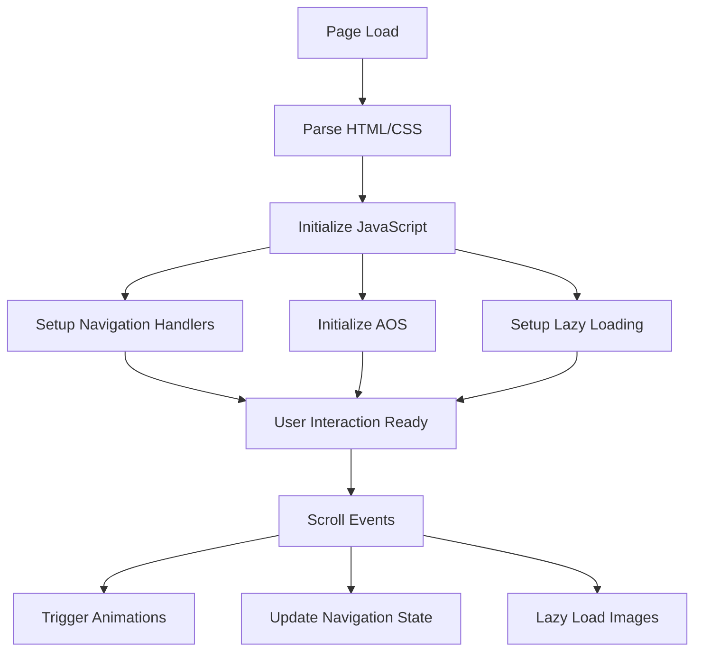

# Design Document

## Overview

This document outlines the technical design for the Budget App official website - a standalone web project showcasing the Android application's six core feature modules. The website prioritizes performance, smooth animations, and responsive design to provide an engaging user experience across all devices.

### Design Philosophy

- **Performance First**: Vanilla JavaScript approach for minimal bundle size and maximum performance
- **Progressive Enhancement**: Core content accessible without JavaScript, enhanced with animations when available
- **Mobile-First**: Responsive design starting from mobile viewports
- **Accessibility**: WCAG 2.1 AA compliance for inclusive user experience

### Technology Stack

**Core Technologies:**
- HTML5 (semantic markup)
- CSS3 (Grid, Flexbox, Custom Properties, Animations)
- Vanilla JavaScript (ES6+)

**Animation Library:**
- AOS (Animate On Scroll) v3.0+ - 8KB gzipped, lightweight scroll animations

**Build Tools:**
- No build step required for development
- Optional: Terser for JS minification, cssnano for CSS minification in production

**Deployment:**
- Static hosting (Netlify, Vercel, GitHub Pages, or any web server)
- CDN for asset delivery

### Why Vanilla JavaScript?

Based on performance research ([content rephrased for compliance with licensing restrictions](https://gomakethings.com/just-how-much-faster-is-vanilla-js-than-frameworks/)):
- Vanilla JS renders UI 5-10x faster than Preact, 30x faster than React
- No hydration overhead or framework bundle size
- Simpler maintenance and no framework upgrade pressure
- Perfect for content-focused landing pages

### Why AOS for Animations?

Based on animation library comparison ([content rephrased for compliance with licensing restrictions](https://wunderlandmedia.com/replace-javascript-animation-library-css)):
- Smallest footprint: 8KB gzipped (vs GSAP 41KB, Framer Motion 32KB)
- Declarative API via HTML data attributes
- Hardware-accelerated CSS animations
- Sufficient for scroll-triggered fade/slide effects


## Architecture

### Project Structure

```
budget-app-website/
├── index.html              # Main landing page
├── assets/
│   ├── css/
│   │   ├── reset.css       # CSS reset/normalize
│   │   ├── variables.css   # CSS custom properties (colors, spacing, typography)
│   │   ├── base.css        # Base styles (typography, global)
│   │   ├── layout.css      # Layout utilities (grid, flexbox)
│   │   ├── components.css  # Component styles (buttons, cards, navigation)
│   │   ├── sections.css    # Section-specific styles (hero, features, download)
│   │   └── animations.css  # Custom animation definitions
│   ├── js/
│   │   ├── main.js         # Main application logic
│   │   ├── navigation.js   # Navigation behavior (smooth scroll, mobile menu)
│   │   ├── animations.js   # Animation initialization and custom effects
│   │   └── utils.js        # Utility functions (lazy loading, performance)
│   ├── images/
│   │   ├── hero/           # Hero section images
│   │   ├── features/       # Feature screenshots/illustrations
│   │   ├── icons/          # Icon assets
│   │   └── logo/           # App logo variants
│   └── fonts/              # Web fonts (if self-hosted)
├── README.md               # Project documentation
└── .gitignore              # Git ignore file
```

### Architecture Layers

```
┌─────────────────────────────────────────┐
│         Presentation Layer              │
│  (HTML Structure + CSS Styling)         │
└─────────────────────────────────────────┘
                  ↓
┌─────────────────────────────────────────┐
│         Interaction Layer               │
│  (JavaScript Event Handlers)            │
└─────────────────────────────────────────┘
                  ↓
┌─────────────────────────────────────────┐
│         Animation Layer                 │
│  (AOS + Custom CSS Animations)          │
└─────────────────────────────────────────┘
```

### Page Flow



### Responsive Breakpoints

```css
/* Mobile First Approach */
/* Base: 320px - 767px (mobile) */

/* Tablet: 768px - 1023px */
@media (min-width: 768px) { }

/* Desktop: 1024px - 1439px */
@media (min-width: 1024px) { }

/* Large Desktop: 1440px+ */
@media (min-width: 1440px) { }
```


## Components and Interfaces

### 1. Navigation Component

**Purpose**: Provide site navigation and section jumping

**HTML Structure**:
```html
<nav class="navbar" id="navbar">
  <div class="navbar-container">
    <a href="#" class="navbar-logo">
      
      <span>Budget App</span>
    </a>
    <button class="navbar-toggle" aria-label="Toggle navigation">
      <span></span>
      <span></span>
      <span></span>
    </button>
    <ul class="navbar-menu">
      <li><a href="#features" class="navbar-link">功能</a></li>
      <li><a href="#download" class="navbar-link">下载</a></li>
      <li><a href="#about" class="navbar-link">关于</a></li>
    </ul>
  </div>
</nav>
```

**JavaScript Interface**:
```javascript
// navigation.js
class Navigation {
  constructor(navElement) {
    this.nav = navElement;
    this.toggle = navElement.querySelector('.navbar-toggle');
    this.menu = navElement.querySelector('.navbar-menu');
    this.links = navElement.querySelectorAll('.navbar-link');
    this.init();
  }

  init() {
    this.setupSmoothScroll();
    this.setupMobileToggle();
    this.setupScrollSpy();
    this.setupStickyNav();
  }

  setupSmoothScroll() { /* Smooth scroll to sections */ }
  setupMobileToggle() { /* Toggle mobile menu */ }
  setupScrollSpy() { /* Highlight active section */ }
  setupStickyNav() { /* Sticky navigation on scroll */ }
}
```

**CSS States**:
- Default: Transparent background
- Scrolled: Solid background with shadow
- Mobile: Hamburger menu, full-screen overlay

**Behavior**:
- Smooth scroll to target section (800ms duration, ease-in-out)
- Active link highlighting based on scroll position
- Mobile menu closes after link click
- Sticky positioning after 100px scroll

---

### 2. Hero Section Component

**Purpose**: First impression, app introduction, primary CTA

**HTML Structure**:
```html
<section class="hero" id="hero">
  <div class="hero-container">
    <div class="hero-content" data-aos="fade-up" data-aos-duration="800">
      <h1 class="hero-title">智能预算管理</h1>
      <p class="hero-subtitle">让每一笔收支都清晰可见</p>
      <div class="hero-cta">
        <a href="#download" class="btn btn-primary">立即下载</a>
        <a href="#features" class="btn btn-secondary">了解更多</a>
      </div>
    </div>
    <div class="hero-image" data-aos="fade-left" data-aos-duration="800" data-aos-delay="200">
      
    </div>
  </div>
</section>
```

**Animations**:
- Content: Fade up (800ms)
- Image: Fade left (800ms, 200ms delay)
- CTA buttons: Hover scale (1.05), transition 200ms

---

### 3. Feature Card Component

**Purpose**: Showcase individual app features

**HTML Structure**:
```html
<div class="feature-card" data-aos="fade-up" data-aos-duration="600">
  <div class="feature-icon">
    
  </div>
  <h3 class="feature-title">交易记录</h3>
  <p class="feature-description">
    快速记录每一笔收支，支持分类管理和关键词自动识别，让记账变得简单高效。
  </p>
  <ul class="feature-list">
    <li>收入/支出快速记录</li>
    <li>智能分类管理</li>
    <li>关键词自动识别</li>
    <li>照片备份功能</li>
  </ul>
</div>
```

**CSS Styling**:
```css
.feature-card {
  background: var(--card-bg);
  border-radius: var(--radius-lg);
  padding: var(--space-lg);
  box-shadow: var(--shadow-md);
  transition: transform 0.3s ease, box-shadow 0.3s ease;
}

.feature-card:hover {
  transform: translateY(-8px);
  box-shadow: var(--shadow-lg);
}
```

**Animations**:
- Scroll trigger: Fade up (600ms)
- Hover: Translate Y -8px, enhanced shadow (300ms)

---

### 4. Features Section Component

**Purpose**: Display all six core features in a grid layout

**HTML Structure**:
```html
<section class="features" id="features">
  <div class="features-container">
    <div class="section-header" data-aos="fade-up">
      <h2 class="section-title">核心功能</h2>
      <p class="section-subtitle">六大模块，全方位管理您的财务</p>
    </div>
    <div class="features-grid">
      <!-- 6 Feature Cards -->
      <div class="feature-card">...</div>
      <div class="feature-card">...</div>
      <div class="feature-card">...</div>
      <div class="feature-card">...</div>
      <div class="feature-card">...</div>
      <div class="feature-card">...</div>
    </div>
  </div>
</section>
```

**Grid Layout**:
```css
.features-grid {
  display: grid;
  gap: var(--space-lg);
  
  /* Mobile: 1 column */
  grid-template-columns: 1fr;
  
  /* Tablet: 2 columns */
  @media (min-width: 768px) {
    grid-template-columns: repeat(2, 1fr);
  }
  
  /* Desktop: 3 columns */
  @media (min-width: 1024px) {
    grid-template-columns: repeat(3, 1fr);
  }
}
```

**Feature Cards Content**:

1. **Transaction (交易记录)**
   - Icon: Receipt/transaction icon
   - Description: 收入/支出记录、分类管理、关键词识别、照片备份

2. **Asset Account (资产账户)**
   - Icon: Wallet/account icon
   - Description: 多账户管理、自动资产跟踪、账户余额计算

3. **Budget (预算管理)**
   - Icon: Target/budget icon
   - Description: 预算设置、预算历史、超支提醒

4. **Goal (目标管理)**
   - Icon: Flag/goal icon
   - Description: 储蓄目标、进度跟踪

5. **Auto Renewal (自动续费)**
   - Icon: Refresh/subscription icon
   - Description: 订阅管理、续费提醒

6. **Backup (数据备份)**
   - Icon: Cloud/backup icon
   - Description: WebDAV 云端备份、自动同步、本地导出/导入

---

### 5. Download Section Component

**Purpose**: Provide app download information and links

**HTML Structure**:
```html
<section class="download" id="download">
  <div class="download-container">
    <div class="download-content" data-aos="fade-right">
      <h2 class="download-title">立即下载</h2>
      <p class="download-subtitle">开始您的智能预算管理之旅</p>
      <div class="download-info">
        <div class="info-item">
          <span class="info-label">版本</span>
          <span class="info-value">v1.0.0</span>
        </div>
        <div class="info-item">
          <span class="info-label">大小</span>
          <span class="info-value">12.5 MB</span>
        </div>
        <div class="info-item">
          <span class="info-label">系统要求</span>
          <span class="info-value">Android 8.0+</span>
        </div>
      </div>
      <div class="download-buttons">
        <a href="#" class="btn btn-primary btn-large">
          <svg><!-- Android icon --></svg>
          Android 下载
        </a>
        <!-- Or Coming Soon state -->
        <div class="coming-soon">
          <span>即将上线</span>
        </div>
      </div>
    </div>
    <div class="download-qr" data-aos="fade-left">
      
      <p>扫码下载</p>
    </div>
  </div>
</section>
```

---

### 6. Footer Component

**Purpose**: Site footer with links and information

**HTML Structure**:
```html
<footer class="footer">
  <div class="footer-container">
    <div class="footer-content">
      <div class="footer-brand">
        
        <p>智能预算管理应用</p>
      </div>
      <div class="footer-links">
        <div class="footer-column">
          <h4>产品</h4>
          <ul>
            <li><a href="#features">功能介绍</a></li>
            <li><a href="#download">下载应用</a></li>
          </ul>
        </div>
        <div class="footer-column">
          <h4>支持</h4>
          <ul>
            <li><a href="#about">关于我们</a></li>
            <li><a href="mailto:support@budgetapp.com">联系我们</a></li>
          </ul>
        </div>
      </div>
    </div>
    <div class="footer-bottom">
      <p>&copy; 2024 Budget App. All rights reserved.</p>
    </div>
  </div>
</footer>
```


## Data Models

### Configuration Object

Since this is a static website, data is embedded in HTML/JavaScript. For maintainability, feature data is centralized:

```javascript
// main.js or data.js
const SITE_CONFIG = {
  app: {
    name: 'Budget App',
    version: '1.0.0',
    size: '12.5 MB',
    minAndroidVersion: '8.0',
    downloadUrl: '', // Empty if not available
  },
  
  features: [
    {
      id: 'transaction',
      icon: 'assets/images/icons/transaction.svg',
      title: '交易记录',
      description: '快速记录每一笔收支，支持分类管理和关键词自动识别，让记账变得简单高效。',
      highlights: [
        '收入/支出快速记录',
        '智能分类管理',
        '关键词自动识别',
        '照片备份功能'
      ]
    },
    {
      id: 'asset',
      icon: 'assets/images/icons/asset.svg',
      title: '资产账户',
      description: '管理多个账户，自动跟踪资产变化，实时计算账户余额。',
      highlights: [
        '多账户管理',
        '自动资产跟踪',
        '账户余额计算'
      ]
    },
    {
      id: 'budget',
      icon: 'assets/images/icons/budget.svg',
      title: '预算管理',
      description: '设置月度预算，查看历史记录，超支时及时提醒。',
      highlights: [
        '预算设置',
        '预算历史',
        '超支提醒'
      ]
    },
    {
      id: 'goal',
      icon: 'assets/images/icons/goal.svg',
      title: '目标管理',
      description: '设定储蓄目标，跟踪进度，实现财务规划。',
      highlights: [
        '储蓄目标设定',
        '进度跟踪'
      ]
    },
    {
      id: 'renewal',
      icon: 'assets/images/icons/renewal.svg',
      title: '自动续费',
      description: '管理订阅服务，设置续费提醒，避免忘记取消。',
      highlights: [
        '订阅管理',
        '续费提醒'
      ]
    },
    {
      id: 'backup',
      icon: 'assets/images/icons/backup.svg',
      title: '数据备份',
      description: 'WebDAV 云端备份，自动同步，支持本地导出导入。',
      highlights: [
        'WebDAV 云端备份',
        '自动同步功能',
        '本地导出/导入 (ZIP, CSV)',
        '第三方应用数据导入'
      ]
    }
  ],
  
  navigation: [
    { label: '功能', href: '#features' },
    { label: '下载', href: '#download' },
    { label: '关于', href: '#about' }
  ]
};
```

### Animation Configuration

```javascript
const ANIMATION_CONFIG = {
  aos: {
    duration: 600,
    easing: 'ease-in-out',
    once: true, // Animate only once
    offset: 120, // Trigger 120px before element enters viewport
    delay: 0,
    anchorPlacement: 'top-bottom'
  },
  
  smoothScroll: {
    duration: 800,
    easing: 'easeInOutCubic',
    offset: -80 // Account for sticky navbar height
  },
  
  transitions: {
    fast: '200ms',
    normal: '300ms',
    slow: '600ms'
  }
};
```

### Performance Thresholds

```javascript
const PERFORMANCE_CONFIG = {
  lazyLoad: {
    rootMargin: '200px', // Start loading 200px before viewport
    threshold: 0.01
  },
  
  debounce: {
    scroll: 100, // ms
    resize: 250  // ms
  },
  
  targets: {
    fcp: 1500,        // First Contentful Paint (ms)
    lighthouse: 90,   // Lighthouse score
    maxImageSize: 500 // KB
  }
};
```


## Error Handling

### JavaScript Error Handling

**1. Graceful Degradation**

If JavaScript fails to load or execute, the website should remain functional:

```html
<noscript>
  <div class="noscript-warning">
    <p>本网站在启用 JavaScript 时体验最佳，但核心内容仍可访问。</p>
  </div>
</noscript>
```

**2. Animation Library Fallback**

```javascript
// animations.js
function initAnimations() {
  try {
    if (typeof AOS !== 'undefined') {
      AOS.init(ANIMATION_CONFIG.aos);
    } else {
      console.warn('AOS library not loaded, animations disabled');
      // Remove data-aos attributes to prevent layout issues
      document.querySelectorAll('[data-aos]').forEach(el => {
        el.removeAttribute('data-aos');
      });
    }
  } catch (error) {
    console.error('Animation initialization failed:', error);
  }
}
```

**3. Image Loading Errors**

```javascript
// utils.js
function handleImageError(img) {
  img.onerror = function() {
    // Replace with placeholder
    this.src = 'assets/images/placeholder.svg';
    this.alt = 'Image not available';
    console.warn(`Failed to load image: ${this.dataset.src || this.src}`);
  };
}

// Apply to all images
document.querySelectorAll('img').forEach(handleImageError);
```

**4. Smooth Scroll Fallback**

```javascript
// navigation.js
function smoothScrollTo(target, duration) {
  try {
    // Modern browsers: smooth scroll
    if ('scrollBehavior' in document.documentElement.style) {
      target.scrollIntoView({ behavior: 'smooth', block: 'start' });
    } else {
      // Fallback: instant scroll
      target.scrollIntoView();
    }
  } catch (error) {
    console.error('Scroll failed:', error);
    // Last resort: change location hash
    window.location.hash = target.id;
  }
}
```

### CSS Fallbacks

**1. CSS Grid Fallback**

```css
/* Flexbox fallback for older browsers */
.features-grid {
  display: flex;
  flex-wrap: wrap;
  gap: var(--space-lg);
}

/* Modern browsers: CSS Grid */
@supports (display: grid) {
  .features-grid {
    display: grid;
    grid-template-columns: repeat(auto-fit, minmax(300px, 1fr));
  }
}
```

**2. CSS Custom Properties Fallback**

```css
.hero {
  /* Fallback for browsers without CSS variables */
  background-color: #1a1a2e;
  
  /* Modern browsers */
  background-color: var(--color-primary, #1a1a2e);
}
```

**3. Backdrop Filter Fallback**

```css
.navbar-scrolled {
  background-color: rgba(255, 255, 255, 0.95);
  backdrop-filter: blur(10px);
}

/* Fallback for browsers without backdrop-filter */
@supports not (backdrop-filter: blur(10px)) {
  .navbar-scrolled {
    background-color: rgba(255, 255, 255, 1);
  }
}
```

### Network Error Handling

**1. CDN Fallback**

```html
<!-- Primary CDN -->
<script src="https://cdn.jsdelivr.net/npm/aos@3.0.0/dist/aos.js"></script>

<!-- Fallback to local copy -->
<script>
  if (typeof AOS === 'undefined') {
    document.write('<script src="assets/js/vendor/aos.js"><\/script>');
  }
</script>
```

**2. Font Loading Strategy**

```css
/* System font stack as fallback */
body {
  font-family: -apple-system, BlinkMacSystemFont, 'Segoe UI', Roboto, 
               'Helvetica Neue', Arial, sans-serif;
}

/* Web font with font-display: swap */
@font-face {
  font-family: 'CustomFont';
  src: url('assets/fonts/custom-font.woff2') format('woff2');
  font-display: swap; /* Show fallback immediately, swap when loaded */
}
```

### Browser Compatibility Errors

**1. Feature Detection**

```javascript
// utils.js
const BROWSER_SUPPORT = {
  intersectionObserver: 'IntersectionObserver' in window,
  smoothScroll: 'scrollBehavior' in document.documentElement.style,
  cssGrid: CSS.supports('display', 'grid'),
  webp: false // Detected asynchronously
};

// Detect WebP support
function detectWebP() {
  const webpData = 'data:image/webp;base64,UklGRiQAAABXRUJQVlA4IBgAAAAwAQCdASoBAAEAAwA0JaQAA3AA/vuUAAA=';
  const img = new Image();
  img.onload = img.onerror = function() {
    BROWSER_SUPPORT.webp = (img.height === 1);
  };
  img.src = webpData;
}

detectWebP();
```

**2. Polyfill Loading**

```javascript
// Load polyfills only if needed
if (!BROWSER_SUPPORT.intersectionObserver) {
  loadScript('assets/js/polyfills/intersection-observer.js');
}

function loadScript(src) {
  return new Promise((resolve, reject) => {
    const script = document.createElement('script');
    script.src = src;
    script.onload = resolve;
    script.onerror = reject;
    document.head.appendChild(script);
  });
}
```

### User Feedback

**1. Loading States**

```html
<!-- Show loading indicator for slow connections -->
<div class="page-loader" id="pageLoader">
  <div class="loader-spinner"></div>
  <p>加载中...</p>
</div>
```

```javascript
// Hide loader when page is ready
window.addEventListener('load', () => {
  const loader = document.getElementById('pageLoader');
  loader.classList.add('fade-out');
  setTimeout(() => loader.remove(), 300);
});
```

**2. Error Messages**

```javascript
// Display user-friendly error messages
function showError(message) {
  const errorDiv = document.createElement('div');
  errorDiv.className = 'error-toast';
  errorDiv.textContent = message;
  document.body.appendChild(errorDiv);
  
  setTimeout(() => {
    errorDiv.classList.add('fade-out');
    setTimeout(() => errorDiv.remove(), 300);
  }, 3000);
}
```


## Testing Strategy

### Overview

Since this is a **static website focused on presentation and UI/UX**, Property-Based Testing (PBT) is **not applicable**. The testing strategy focuses on:

1. **Visual Regression Testing** - Ensure UI consistency across changes
2. **Cross-Browser Testing** - Verify functionality across browsers
3. **Responsive Design Testing** - Validate layouts at different viewports
4. **Performance Testing** - Measure load times and Lighthouse scores
5. **Accessibility Testing** - Ensure WCAG 2.1 AA compliance
6. **Manual Testing** - Verify animations and interactions

### Why PBT is Not Applicable

Property-Based Testing is designed for testing universal properties across many generated inputs (e.g., parsers, algorithms, business logic). This website project involves:

- **Static content rendering** - No complex data transformations
- **UI interactions** - Click, scroll, hover behaviors
- **Visual animations** - CSS transitions and scroll effects
- **Layout responsiveness** - CSS media queries

None of these involve testable universal properties that would benefit from randomized input generation. Instead, we use **example-based tests** and **visual regression tests**.

---

### 1. Visual Regression Testing

**Tool**: [BackstopJS](https://github.com/garris/BackstopJS) or [Percy](https://percy.io/)

**Purpose**: Detect unintended visual changes

**Test Scenarios**:
```javascript
// backstop.config.js
module.exports = {
  scenarios: [
    {
      label: 'Hero Section - Desktop',
      url: 'http://localhost:8080/index.html',
      selectors: ['.hero'],
      viewports: [{ width: 1920, height: 1080 }]
    },
    {
      label: 'Hero Section - Mobile',
      url: 'http://localhost:8080/index.html',
      selectors: ['.hero'],
      viewports: [{ width: 375, height: 667 }]
    },
    {
      label: 'Features Grid - Desktop',
      url: 'http://localhost:8080/index.html',
      selectors: ['.features'],
      viewports: [{ width: 1920, height: 1080 }]
    },
    {
      label: 'Features Grid - Tablet',
      url: 'http://localhost:8080/index.html',
      selectors: ['.features'],
      viewports: [{ width: 768, height: 1024 }]
    },
    {
      label: 'Navigation - Mobile Menu Open',
      url: 'http://localhost:8080/index.html',
      selectors: ['.navbar'],
      clickSelector: '.navbar-toggle',
      viewports: [{ width: 375, height: 667 }]
    },
    {
      label: 'Download Section',
      url: 'http://localhost:8080/index.html',
      selectors: ['.download'],
      viewports: [{ width: 1920, height: 1080 }]
    },
    {
      label: 'Footer',
      url: 'http://localhost:8080/index.html',
      selectors: ['.footer'],
      viewports: [{ width: 1920, height: 1080 }]
    }
  ]
};
```

**Execution**:
```bash
# Create reference screenshots
npm run test:visual:reference

# Compare against reference
npm run test:visual:test

# Approve changes
npm run test:visual:approve
```

---

### 2. Cross-Browser Testing

**Tools**: 
- [BrowserStack](https://www.browserstack.com/) or [Sauce Labs](https://saucelabs.com/)
- Local testing with browser DevTools

**Test Matrix**:

| Browser | Version | Desktop | Mobile |
|---------|---------|---------|--------|
| Chrome  | 90+     | ✓       | ✓      |
| Firefox | 88+     | ✓       | ✓      |
| Safari  | 14+     | ✓       | ✓      |
| Edge    | 90+     | ✓       | -      |

**Test Cases**:

1. **Navigation**
   - [ ] Smooth scroll to sections works
   - [ ] Active link highlighting updates on scroll
   - [ ] Mobile menu opens/closes correctly
   - [ ] Logo click scrolls to top

2. **Animations**
   - [ ] AOS animations trigger on scroll
   - [ ] Hero section animates on page load
   - [ ] Feature cards fade in sequentially
   - [ ] Hover effects work on interactive elements

3. **Responsive Layout**
   - [ ] No horizontal scrolling at any viewport
   - [ ] Images scale appropriately
   - [ ] Text remains readable at all sizes
   - [ ] Grid layouts adapt correctly

4. **Forms & Interactions**
   - [ ] Download buttons are clickable
   - [ ] Links navigate correctly
   - [ ] Keyboard navigation works (Tab, Enter)

---

### 3. Responsive Design Testing

**Viewports to Test**:

```javascript
const VIEWPORTS = [
  { name: 'iPhone SE', width: 375, height: 667 },
  { name: 'iPhone 12 Pro', width: 390, height: 844 },
  { name: 'iPad', width: 768, height: 1024 },
  { name: 'iPad Pro', width: 1024, height: 1366 },
  { name: 'Desktop HD', width: 1920, height: 1080 },
  { name: 'Desktop 4K', width: 3840, height: 2160 }
];
```

**Manual Checklist**:

- [ ] **Mobile (320px - 767px)**
  - [ ] Single column layout
  - [ ] Hamburger menu visible
  - [ ] Touch targets ≥ 44x44px
  - [ ] No text overflow

- [ ] **Tablet (768px - 1023px)**
  - [ ] Two-column feature grid
  - [ ] Navigation menu visible
  - [ ] Images scale proportionally

- [ ] **Desktop (1024px+)**
  - [ ] Three-column feature grid
  - [ ] Sticky navigation
  - [ ] Optimal line length (50-75 characters)

---

### 4. Performance Testing

**Tool**: [Lighthouse CI](https://github.com/GoogleChrome/lighthouse-ci)

**Performance Budget**:

```javascript
// lighthouserc.js
module.exports = {
  ci: {
    collect: {
      url: ['http://localhost:8080/index.html'],
      numberOfRuns: 3
    },
    assert: {
      assertions: {
        'categories:performance': ['error', { minScore: 0.9 }],
        'categories:accessibility': ['error', { minScore: 0.9 }],
        'categories:best-practices': ['error', { minScore: 0.9 }],
        'categories:seo': ['error', { minScore: 0.9 }],
        
        'first-contentful-paint': ['error', { maxNumericValue: 1500 }],
        'largest-contentful-paint': ['error', { maxNumericValue: 2500 }],
        'cumulative-layout-shift': ['error', { maxNumericValue: 0.1 }],
        'total-blocking-time': ['error', { maxNumericValue: 300 }],
        
        'resource-summary:script:size': ['error', { maxNumericValue: 100000 }],
        'resource-summary:stylesheet:size': ['error', { maxNumericValue: 50000 }],
        'resource-summary:image:size': ['error', { maxNumericValue: 500000 }]
      }
    }
  }
};
```

**Metrics to Monitor**:

| Metric | Target | Requirement |
|--------|--------|-------------|
| First Contentful Paint (FCP) | < 1.5s | Requirement 6.1 |
| Largest Contentful Paint (LCP) | < 2.5s | Core Web Vital |
| Cumulative Layout Shift (CLS) | < 0.1 | Core Web Vital |
| Total Blocking Time (TBT) | < 300ms | Interactivity |
| Lighthouse Performance Score | ≥ 90 | Requirement 6.5 |

**Execution**:
```bash
# Run Lighthouse audit
npm run test:performance

# Generate report
npm run test:performance:report
```

---

### 5. Accessibility Testing

**Tools**:
- [axe DevTools](https://www.deque.com/axe/devtools/)
- [WAVE](https://wave.webaim.org/)
- Manual keyboard testing
- Screen reader testing (NVDA, JAWS, VoiceOver)

**Automated Tests**:

```javascript
// Using axe-core
const { AxePuppeteer } = require('@axe-core/puppeteer');
const puppeteer = require('puppeteer');

async function testAccessibility() {
  const browser = await puppeteer.launch();
  const page = await browser.newPage();
  await page.goto('http://localhost:8080/index.html');
  
  const results = await new AxePuppeteer(page).analyze();
  
  console.log(`Found ${results.violations.length} accessibility violations`);
  results.violations.forEach(violation => {
    console.log(`- ${violation.id}: ${violation.description}`);
  });
  
  await browser.close();
  
  if (results.violations.length > 0) {
    process.exit(1);
  }
}

testAccessibility();
```

**Manual Checklist**:

- [ ] **Keyboard Navigation** (Requirement 7.3)
  - [ ] Tab through all interactive elements
  - [ ] Enter activates buttons/links
  - [ ] Escape closes mobile menu
  - [ ] Focus indicators visible

- [ ] **Screen Reader** (Requirement 7.4)
  - [ ] Semantic HTML elements used
  - [ ] Skip-to-content link present
  - [ ] Images have alt text
  - [ ] ARIA labels where needed

- [ ] **Color Contrast** (Requirement 7.2)
  - [ ] Text contrast ≥ 4.5:1
  - [ ] Large text contrast ≥ 3:1
  - [ ] Interactive elements distinguishable

- [ ] **Alternative Text** (Requirement 7.1)
  - [ ] All images have alt attributes
  - [ ] Decorative images use alt=""
  - [ ] Icons have aria-label

---

### 6. Animation Testing

**Manual Test Cases**:

1. **Hero Section Animation** (Requirement 3.5)
   - [ ] Content fades up within 800ms
   - [ ] Image fades left with 200ms delay
   - [ ] Animation completes smoothly

2. **Feature Cards Animation** (Requirement 3.1)
   - [ ] Cards fade in on scroll
   - [ ] Duration between 300ms-600ms
   - [ ] Stagger effect visible

3. **Hover Effects** (Requirement 3.2)
   - [ ] Visual feedback within 100ms
   - [ ] Smooth transitions
   - [ ] No layout shift

4. **Smooth Scroll** (Requirement 3.3)
   - [ ] Navigation links scroll smoothly
   - [ ] Easing applied correctly
   - [ ] Target section reached accurately

5. **Hardware Acceleration** (Requirement 3.4)
   - [ ] Animations use transform/opacity
   - [ ] No janky scrolling
   - [ ] 60fps maintained

**Performance Profiling**:
```javascript
// Check animation frame rate
const fps = [];
let lastTime = performance.now();

function measureFPS() {
  const now = performance.now();
  const delta = now - lastTime;
  fps.push(1000 / delta);
  lastTime = now;
  
  if (fps.length > 60) {
    const avgFPS = fps.reduce((a, b) => a + b) / fps.length;
    console.log(`Average FPS: ${avgFPS.toFixed(2)}`);
    fps.length = 0;
  }
  
  requestAnimationFrame(measureFPS);
}

measureFPS();
```

---

### 7. Integration Testing

**Test Scenarios**:

```javascript
// Using Puppeteer for end-to-end tests
const puppeteer = require('puppeteer');

describe('Budget App Website', () => {
  let browser, page;
  
  beforeAll(async () => {
    browser = await puppeteer.launch();
    page = await browser.newPage();
    await page.goto('http://localhost:8080/index.html');
  });
  
  afterAll(async () => {
    await browser.close();
  });
  
  test('Navigation scrolls to sections', async () => {
    await page.click('a[href="#features"]');
    await page.waitForTimeout(1000); // Wait for smooth scroll
    
    const featuresPosition = await page.evaluate(() => {
      return document.querySelector('#features').getBoundingClientRect().top;
    });
    
    expect(featuresPosition).toBeLessThan(100); // Near top of viewport
  });
  
  test('Mobile menu toggles', async () => {
    await page.setViewport({ width: 375, height: 667 });
    
    const menuHidden = await page.$eval('.navbar-menu', 
      el => getComputedStyle(el).display === 'none'
    );
    expect(menuHidden).toBe(true);
    
    await page.click('.navbar-toggle');
    await page.waitForTimeout(300);
    
    const menuVisible = await page.$eval('.navbar-menu', 
      el => getComputedStyle(el).display !== 'none'
    );
    expect(menuVisible).toBe(true);
  });
  
  test('Images lazy load', async () => {
    const lazyImages = await page.$$('img[loading="lazy"]');
    expect(lazyImages.length).toBeGreaterThan(0);
  });
  
  test('AOS animations initialize', async () => {
    const aosInitialized = await page.evaluate(() => {
      return typeof AOS !== 'undefined' && AOS.init;
    });
    expect(aosInitialized).toBe(true);
  });
});
```

---

### Test Execution Plan

**Development Phase**:
```bash
# Start local server
npm run serve

# Run accessibility tests
npm run test:a11y

# Manual testing in browser
# - Test navigation
# - Test animations
# - Test responsive layouts
```

**Pre-Deployment**:
```bash
# Run full test suite
npm run test:all

# Visual regression tests
npm run test:visual

# Performance audit
npm run test:performance

# Cross-browser tests (BrowserStack)
npm run test:browsers
```

**Continuous Integration**:
```yaml
# .github/workflows/test.yml
name: Test Website

on: [push, pull_request]

jobs:
  test:
    runs-on: ubuntu-latest
    steps:
      - uses: actions/checkout@v2
      - uses: actions/setup-node@v2
      
      - name: Install dependencies
        run: npm install
      
      - name: Run Lighthouse CI
        run: npm run test:performance
      
      - name: Run accessibility tests
        run: npm run test:a11y
      
      - name: Run visual regression tests
        run: npm run test:visual
```

---

### Test Coverage Goals

| Test Type | Coverage Target | Priority |
|-----------|----------------|----------|
| Visual Regression | All major sections | High |
| Cross-Browser | 4 browsers × 2 viewports | High |
| Accessibility | 0 violations | High |
| Performance | Lighthouse ≥ 90 | High |
| Responsive | 6 viewports | Medium |
| Animation | All transitions | Medium |


## Design System

### Color Palette

```css
:root {
  /* Primary Colors */
  --color-primary: #4A90E2;
  --color-primary-dark: #357ABD;
  --color-primary-light: #6BA3E8;
  
  /* Secondary Colors */
  --color-secondary: #50C878;
  --color-secondary-dark: #3DA860;
  --color-secondary-light: #6DD48E;
  
  /* Neutral Colors */
  --color-dark: #1A1A2E;
  --color-dark-light: #2D2D44;
  --color-gray: #6B7280;
  --color-gray-light: #9CA3AF;
  --color-light: #F3F4F6;
  --color-white: #FFFFFF;
  
  /* Semantic Colors */
  --color-success: #10B981;
  --color-warning: #F59E0B;
  --color-error: #EF4444;
  --color-info: #3B82F6;
  
  /* Background Colors */
  --bg-primary: #FFFFFF;
  --bg-secondary: #F9FAFB;
  --bg-dark: #1A1A2E;
  
  /* Text Colors */
  --text-primary: #1F2937;
  --text-secondary: #6B7280;
  --text-inverse: #FFFFFF;
  
  /* Border Colors */
  --border-light: #E5E7EB;
  --border-medium: #D1D5DB;
  --border-dark: #9CA3AF;
}
```

### Typography

```css
:root {
  /* Font Families */
  --font-primary: -apple-system, BlinkMacSystemFont, 'Segoe UI', Roboto, 
                  'Helvetica Neue', Arial, sans-serif;
  --font-heading: 'Inter', var(--font-primary);
  --font-mono: 'SF Mono', Monaco, 'Cascadia Code', 'Courier New', monospace;
  
  /* Font Sizes */
  --text-xs: 0.75rem;    /* 12px */
  --text-sm: 0.875rem;   /* 14px */
  --text-base: 1rem;     /* 16px */
  --text-lg: 1.125rem;   /* 18px */
  --text-xl: 1.25rem;    /* 20px */
  --text-2xl: 1.5rem;    /* 24px */
  --text-3xl: 1.875rem;  /* 30px */
  --text-4xl: 2.25rem;   /* 36px */
  --text-5xl: 3rem;      /* 48px */
  --text-6xl: 3.75rem;   /* 60px */
  
  /* Font Weights */
  --font-normal: 400;
  --font-medium: 500;
  --font-semibold: 600;
  --font-bold: 700;
  
  /* Line Heights */
  --leading-tight: 1.25;
  --leading-normal: 1.5;
  --leading-relaxed: 1.75;
  
  /* Letter Spacing */
  --tracking-tight: -0.025em;
  --tracking-normal: 0;
  --tracking-wide: 0.025em;
}
```

### Spacing Scale

```css
:root {
  /* Spacing (8px base unit) */
  --space-0: 0;
  --space-1: 0.25rem;   /* 4px */
  --space-2: 0.5rem;    /* 8px */
  --space-3: 0.75rem;   /* 12px */
  --space-4: 1rem;      /* 16px */
  --space-5: 1.25rem;   /* 20px */
  --space-6: 1.5rem;    /* 24px */
  --space-8: 2rem;      /* 32px */
  --space-10: 2.5rem;   /* 40px */
  --space-12: 3rem;     /* 48px */
  --space-16: 4rem;     /* 64px */
  --space-20: 5rem;     /* 80px */
  --space-24: 6rem;     /* 96px */
  --space-32: 8rem;     /* 128px */
  
  /* Semantic Spacing */
  --space-xs: var(--space-2);
  --space-sm: var(--space-4);
  --space-md: var(--space-6);
  --space-lg: var(--space-8);
  --space-xl: var(--space-12);
  --space-2xl: var(--space-16);
}
```

### Border Radius

```css
:root {
  --radius-none: 0;
  --radius-sm: 0.25rem;   /* 4px */
  --radius-md: 0.5rem;    /* 8px */
  --radius-lg: 0.75rem;   /* 12px */
  --radius-xl: 1rem;      /* 16px */
  --radius-2xl: 1.5rem;   /* 24px */
  --radius-full: 9999px;
}
```

### Shadows

```css
:root {
  --shadow-sm: 0 1px 2px 0 rgba(0, 0, 0, 0.05);
  --shadow-md: 0 4px 6px -1px rgba(0, 0, 0, 0.1),
               0 2px 4px -1px rgba(0, 0, 0, 0.06);
  --shadow-lg: 0 10px 15px -3px rgba(0, 0, 0, 0.1),
               0 4px 6px -2px rgba(0, 0, 0, 0.05);
  --shadow-xl: 0 20px 25px -5px rgba(0, 0, 0, 0.1),
               0 10px 10px -5px rgba(0, 0, 0, 0.04);
  --shadow-2xl: 0 25px 50px -12px rgba(0, 0, 0, 0.25);
}
```

### Transitions

```css
:root {
  /* Durations */
  --duration-fast: 150ms;
  --duration-normal: 300ms;
  --duration-slow: 500ms;
  
  /* Easing Functions */
  --ease-in: cubic-bezier(0.4, 0, 1, 1);
  --ease-out: cubic-bezier(0, 0, 0.2, 1);
  --ease-in-out: cubic-bezier(0.4, 0, 0.2, 1);
  --ease-bounce: cubic-bezier(0.68, -0.55, 0.265, 1.55);
}
```

### Z-Index Scale

```css
:root {
  --z-base: 0;
  --z-dropdown: 1000;
  --z-sticky: 1020;
  --z-fixed: 1030;
  --z-modal-backdrop: 1040;
  --z-modal: 1050;
  --z-popover: 1060;
  --z-tooltip: 1070;
}
```

### Breakpoints

```css
:root {
  --breakpoint-sm: 640px;
  --breakpoint-md: 768px;
  --breakpoint-lg: 1024px;
  --breakpoint-xl: 1280px;
  --breakpoint-2xl: 1536px;
}
```

### Container Widths

```css
:root {
  --container-sm: 640px;
  --container-md: 768px;
  --container-lg: 1024px;
  --container-xl: 1280px;
  --container-2xl: 1536px;
}

.container {
  width: 100%;
  margin-left: auto;
  margin-right: auto;
  padding-left: var(--space-4);
  padding-right: var(--space-4);
}

@media (min-width: 640px) {
  .container { max-width: var(--container-sm); }
}

@media (min-width: 768px) {
  .container { max-width: var(--container-md); }
}

@media (min-width: 1024px) {
  .container { max-width: var(--container-lg); }
}

@media (min-width: 1280px) {
  .container { max-width: var(--container-xl); }
}
```

### Button Styles

```css
.btn {
  display: inline-flex;
  align-items: center;
  justify-content: center;
  padding: var(--space-3) var(--space-6);
  font-size: var(--text-base);
  font-weight: var(--font-medium);
  line-height: var(--leading-normal);
  border-radius: var(--radius-lg);
  border: none;
  cursor: pointer;
  transition: all var(--duration-normal) var(--ease-in-out);
  text-decoration: none;
}

.btn-primary {
  background-color: var(--color-primary);
  color: var(--text-inverse);
}

.btn-primary:hover {
  background-color: var(--color-primary-dark);
  transform: translateY(-2px);
  box-shadow: var(--shadow-lg);
}

.btn-secondary {
  background-color: transparent;
  color: var(--color-primary);
  border: 2px solid var(--color-primary);
}

.btn-secondary:hover {
  background-color: var(--color-primary);
  color: var(--text-inverse);
}

.btn-large {
  padding: var(--space-4) var(--space-8);
  font-size: var(--text-lg);
}
```

### Card Styles

```css
.card {
  background-color: var(--bg-primary);
  border-radius: var(--radius-xl);
  padding: var(--space-6);
  box-shadow: var(--shadow-md);
  transition: all var(--duration-normal) var(--ease-in-out);
}

.card:hover {
  transform: translateY(-4px);
  box-shadow: var(--shadow-xl);
}
```


## Performance Optimization

### Image Optimization

**1. Format Selection**

```html
<!-- Use WebP with fallback -->
<picture>
  <source srcset="assets/images/hero/app-mockup.webp" type="image/webp">
  <source srcset="assets/images/hero/app-mockup.png" type="image/png">
  
</picture>
```

**2. Responsive Images**

```html
<!-- Serve different sizes based on viewport -->

```

**3. Lazy Loading**

```javascript
// utils.js - Intersection Observer for lazy loading
function initLazyLoading() {
  const images = document.querySelectorAll('img[loading="lazy"]');
  
  if ('loading' in HTMLImageElement.prototype) {
    // Native lazy loading supported
    return;
  }
  
  // Fallback: Intersection Observer
  const imageObserver = new IntersectionObserver((entries, observer) => {
    entries.forEach(entry => {
      if (entry.isIntersecting) {
        const img = entry.target;
        img.src = img.dataset.src;
        img.classList.remove('lazy');
        observer.unobserve(img);
      }
    });
  }, {
    rootMargin: '200px'
  });
  
  images.forEach(img => imageObserver.observe(img));
}
```

**4. Image Compression Guidelines**

| Image Type | Format | Max Size | Quality |
|------------|--------|----------|---------|
| Hero images | WebP/JPEG | 200 KB | 80% |
| Feature screenshots | WebP/PNG | 150 KB | 85% |
| Icons | SVG | 10 KB | - |
| Thumbnails | WebP/JPEG | 50 KB | 75% |

---

### CSS Optimization

**1. Critical CSS Inlining**

```html
<head>
  <!-- Inline critical CSS for above-the-fold content -->
  <style>
    /* Critical styles for hero section, navigation */
    :root { /* CSS variables */ }
    body { /* Base styles */ }
    .navbar { /* Navigation styles */ }
    .hero { /* Hero section styles */ }
  </style>
  
  <!-- Defer non-critical CSS -->
  <link rel="preload" href="assets/css/main.css" as="style" onload="this.onload=null;this.rel='stylesheet'">
  <noscript><link rel="stylesheet" href="assets/css/main.css"></noscript>
</head>
```

**2. CSS Minification**

```bash
# Using cssnano
npx cssnano assets/css/main.css assets/css/main.min.css
```

**3. Remove Unused CSS**

```bash
# Using PurgeCSS
npx purgecss --css assets/css/*.css --content index.html --output assets/css/
```

---

### JavaScript Optimization

**1. Defer Non-Critical Scripts**

```html
<!-- Critical: Load immediately -->
<script src="assets/js/main.js"></script>

<!-- Non-critical: Defer loading -->
<script src="https://cdn.jsdelivr.net/npm/aos@3.0.0/dist/aos.js" defer></script>
<script src="assets/js/animations.js" defer></script>
```

**2. Code Splitting**

```javascript
// Load modules only when needed
async function loadAnalytics() {
  const { initAnalytics } = await import('./analytics.js');
  initAnalytics();
}

// Load after page is interactive
if (document.readyState === 'complete') {
  loadAnalytics();
} else {
  window.addEventListener('load', loadAnalytics);
}
```

**3. Minification**

```bash
# Using Terser
npx terser assets/js/main.js -o assets/js/main.min.js -c -m
```

**4. Debouncing Scroll Events**

```javascript
// utils.js
function debounce(func, wait) {
  let timeout;
  return function executedFunction(...args) {
    const later = () => {
      clearTimeout(timeout);
      func(...args);
    };
    clearTimeout(timeout);
    timeout = setTimeout(later, wait);
  };
}

// Usage
const handleScroll = debounce(() => {
  // Scroll handling logic
}, 100);

window.addEventListener('scroll', handleScroll);
```

---

### Font Optimization

**1. Font Loading Strategy**

```css
/* Use font-display: swap for faster text rendering */
@font-face {
  font-family: 'Inter';
  src: url('assets/fonts/inter-var.woff2') format('woff2');
  font-weight: 100 900;
  font-display: swap;
}
```

**2. Preload Critical Fonts**

```html
<head>
  <link rel="preload" href="assets/fonts/inter-var.woff2" as="font" type="font/woff2" crossorigin>
</head>
```

**3. Subset Fonts**

```bash
# Use only required characters (Latin + Chinese)
# Reduces font file size by 70-80%
pyftsubset Inter-Regular.ttf \
  --output-file=Inter-Regular-subset.woff2 \
  --flavor=woff2 \
  --unicodes=U+0020-007F,U+4E00-9FFF
```

---

### Resource Hints

```html
<head>
  <!-- DNS Prefetch for external domains -->
  <link rel="dns-prefetch" href="https://cdn.jsdelivr.net">
  
  <!-- Preconnect to critical origins -->
  <link rel="preconnect" href="https://cdn.jsdelivr.net" crossorigin>
  
  <!-- Preload critical resources -->
  <link rel="preload" href="assets/css/critical.css" as="style">
  <link rel="preload" href="assets/fonts/inter-var.woff2" as="font" type="font/woff2" crossorigin>
  <link rel="preload" href="assets/images/hero/app-mockup.webp" as="image">
  
  <!-- Prefetch next-page resources -->
  <link rel="prefetch" href="assets/images/features/transaction.webp">
</head>
```

---

### Caching Strategy

**1. HTTP Cache Headers**

```nginx
# nginx.conf
location ~* \.(jpg|jpeg|png|gif|ico|svg|webp)$ {
  expires 1y;
  add_header Cache-Control "public, immutable";
}

location ~* \.(css|js)$ {
  expires 1y;
  add_header Cache-Control "public, immutable";
}

location ~* \.(html)$ {
  expires 1h;
  add_header Cache-Control "public, must-revalidate";
}
```

**2. Service Worker (Optional)**

```javascript
// sw.js - Basic service worker for offline support
const CACHE_NAME = 'budget-app-v1';
const urlsToCache = [
  '/',
  '/index.html',
  '/assets/css/main.css',
  '/assets/js/main.js',
  '/assets/images/logo/logo.svg'
];

self.addEventListener('install', event => {
  event.waitUntil(
    caches.open(CACHE_NAME)
      .then(cache => cache.addAll(urlsToCache))
  );
});

self.addEventListener('fetch', event => {
  event.respondWith(
    caches.match(event.request)
      .then(response => response || fetch(event.request))
  );
});
```

---

### Compression

**1. Gzip/Brotli Compression**

```nginx
# nginx.conf
gzip on;
gzip_vary on;
gzip_min_length 1024;
gzip_types text/plain text/css text/xml text/javascript 
           application/x-javascript application/xml+rss 
           application/javascript application/json;

# Brotli (if available)
brotli on;
brotli_types text/plain text/css text/xml text/javascript 
             application/x-javascript application/xml+rss 
             application/javascript application/json;
```

**2. Pre-compression**

```bash
# Pre-compress assets during build
find assets -type f \( -name '*.js' -o -name '*.css' -o -name '*.html' \) -exec gzip -k {} \;
find assets -type f \( -name '*.js' -o -name '*.css' -o -name '*.html' \) -exec brotli -k {} \;
```

---

### Performance Monitoring

**1. Real User Monitoring (RUM)**

```javascript
// Track Core Web Vitals
function sendToAnalytics(metric) {
  // Send to analytics service
  console.log(metric);
}

// Largest Contentful Paint (LCP)
new PerformanceObserver((list) => {
  const entries = list.getEntries();
  const lastEntry = entries[entries.length - 1];
  sendToAnalytics({
    name: 'LCP',
    value: lastEntry.renderTime || lastEntry.loadTime,
    rating: lastEntry.renderTime < 2500 ? 'good' : 'poor'
  });
}).observe({ entryTypes: ['largest-contentful-paint'] });

// First Input Delay (FID)
new PerformanceObserver((list) => {
  const firstInput = list.getEntries()[0];
  sendToAnalytics({
    name: 'FID',
    value: firstInput.processingStart - firstInput.startTime,
    rating: firstInput.processingStart - firstInput.startTime < 100 ? 'good' : 'poor'
  });
}).observe({ entryTypes: ['first-input'] });

// Cumulative Layout Shift (CLS)
let clsValue = 0;
new PerformanceObserver((list) => {
  for (const entry of list.getEntries()) {
    if (!entry.hadRecentInput) {
      clsValue += entry.value;
    }
  }
  sendToAnalytics({
    name: 'CLS',
    value: clsValue,
    rating: clsValue < 0.1 ? 'good' : 'poor'
  });
}).observe({ entryTypes: ['layout-shift'] });
```

**2. Performance Budget Monitoring**

```javascript
// Check if performance budget is exceeded
window.addEventListener('load', () => {
  const perfData = performance.getEntriesByType('navigation')[0];
  const resources = performance.getEntriesByType('resource');
  
  const totalSize = resources.reduce((acc, resource) => {
    return acc + (resource.transferSize || 0);
  }, 0);
  
  const budget = {
    totalSize: 1000000, // 1 MB
    loadTime: 3000,     // 3 seconds
  };
  
  if (totalSize > budget.totalSize) {
    console.warn(`Performance budget exceeded: ${(totalSize / 1024).toFixed(2)} KB`);
  }
  
  if (perfData.loadEventEnd > budget.loadTime) {
    console.warn(`Load time budget exceeded: ${perfData.loadEventEnd.toFixed(2)} ms`);
  }
});
```


## Deployment Strategy

### Build Process

**1. Development Build**

```bash
# No build step required - direct file serving
npm run serve
# or
python -m http.server 8080
```

**2. Production Build**

```bash
# build.sh
#!/bin/bash

echo "Building production assets..."

# 1. Minify CSS
npx cssnano assets/css/main.css assets/css/main.min.css

# 2. Minify JavaScript
npx terser assets/js/main.js -o assets/js/main.min.js -c -m
npx terser assets/js/navigation.js -o assets/js/navigation.min.js -c -m
npx terser assets/js/animations.js -o assets/js/animations.min.js -c -m

# 3. Optimize images
npx imagemin assets/images/**/*.{jpg,png} --out-dir=assets/images/optimized

# 4. Generate WebP versions
for img in assets/images/**/*.{jpg,png}; do
  cwebp -q 80 "$img" -o "${img%.*}.webp"
done

# 5. Pre-compress assets
find assets -type f \( -name '*.js' -o -name '*.css' -o -name '*.html' \) -exec gzip -k {} \;

# 6. Update HTML to use minified assets
sed -i 's/main.css/main.min.css/g' index.html
sed -i 's/main.js/main.min.js/g' index.html

echo "Build complete!"
```

**3. Package.json Scripts**

```json
{
  "name": "budget-app-website",
  "version": "1.0.0",
  "scripts": {
    "serve": "python -m http.server 8080",
    "build": "bash build.sh",
    "test": "npm run test:a11y && npm run test:performance",
    "test:a11y": "node tests/accessibility.test.js",
    "test:performance": "lighthouse http://localhost:8080 --output=html --output-path=./reports/lighthouse.html",
    "test:visual": "backstop test",
    "test:visual:reference": "backstop reference",
    "deploy": "npm run build && npm run deploy:netlify"
  },
  "devDependencies": {
    "cssnano": "^6.0.0",
    "terser": "^5.19.0",
    "imagemin": "^8.0.0",
    "imagemin-webp": "^7.0.0",
    "lighthouse": "^11.0.0",
    "@axe-core/puppeteer": "^4.7.0",
    "backstopjs": "^6.2.0"
  }
}
```

---

### Hosting Options

**Option 1: Netlify (Recommended)**

```toml
# netlify.toml
[build]
  command = "npm run build"
  publish = "."

[[headers]]
  for = "/*"
  [headers.values]
    X-Frame-Options = "DENY"
    X-Content-Type-Options = "nosniff"
    X-XSS-Protection = "1; mode=block"
    Referrer-Policy = "strict-origin-when-cross-origin"

[[headers]]
  for = "/*.css"
  [headers.values]
    Cache-Control = "public, max-age=31536000, immutable"

[[headers]]
  for = "/*.js"
  [headers.values]
    Cache-Control = "public, max-age=31536000, immutable"

[[headers]]
  for = "/*.jpg"
  [headers.values]
    Cache-Control = "public, max-age=31536000, immutable"

[[headers]]
  for = "/*.png"
  [headers.values]
    Cache-Control = "public, max-age=31536000, immutable"

[[headers]]
  for = "/*.webp"
  [headers.values]
    Cache-Control = "public, max-age=31536000, immutable"

[[redirects]]
  from = "/*"
  to = "/index.html"
  status = 200
```

**Deployment Command:**
```bash
# Install Netlify CLI
npm install -g netlify-cli

# Deploy
netlify deploy --prod
```

---

**Option 2: Vercel**

```json
// vercel.json
{
  "version": 2,
  "builds": [
    {
      "src": "index.html",
      "use": "@vercel/static"
    }
  ],
  "headers": [
    {
      "source": "/(.*)",
      "headers": [
        {
          "key": "X-Frame-Options",
          "value": "DENY"
        },
        {
          "key": "X-Content-Type-Options",
          "value": "nosniff"
        }
      ]
    },
    {
      "source": "/assets/(.*)",
      "headers": [
        {
          "key": "Cache-Control",
          "value": "public, max-age=31536000, immutable"
        }
      ]
    }
  ]
}
```

**Deployment Command:**
```bash
# Install Vercel CLI
npm install -g vercel

# Deploy
vercel --prod
```

---

**Option 3: GitHub Pages**

```yaml
# .github/workflows/deploy.yml
name: Deploy to GitHub Pages

on:
  push:
    branches: [ main ]

jobs:
  deploy:
    runs-on: ubuntu-latest
    steps:
      - uses: actions/checkout@v3
      
      - name: Setup Node.js
        uses: actions/setup-node@v3
        with:
          node-version: '18'
      
      - name: Install dependencies
        run: npm install
      
      - name: Build
        run: npm run build
      
      - name: Deploy to GitHub Pages
        uses: peaceiris/actions-gh-pages@v3
        with:
          github_token: ${{ secrets.GITHUB_TOKEN }}
          publish_dir: .
```

---

**Option 4: Traditional Web Server (Nginx)**

```nginx
# /etc/nginx/sites-available/budget-app
server {
    listen 80;
    server_name budgetapp.example.com;
    
    # Redirect to HTTPS
    return 301 https://$server_name$request_uri;
}

server {
    listen 443 ssl http2;
    server_name budgetapp.example.com;
    
    # SSL Configuration
    ssl_certificate /etc/letsencrypt/live/budgetapp.example.com/fullchain.pem;
    ssl_certificate_key /etc/letsencrypt/live/budgetapp.example.com/privkey.pem;
    
    # Root directory
    root /var/www/budget-app-website;
    index index.html;
    
    # Gzip compression
    gzip on;
    gzip_vary on;
    gzip_min_length 1024;
    gzip_types text/plain text/css text/xml text/javascript 
               application/x-javascript application/xml+rss 
               application/javascript application/json image/svg+xml;
    
    # Security headers
    add_header X-Frame-Options "DENY" always;
    add_header X-Content-Type-Options "nosniff" always;
    add_header X-XSS-Protection "1; mode=block" always;
    add_header Referrer-Policy "strict-origin-when-cross-origin" always;
    
    # Cache static assets
    location ~* \.(jpg|jpeg|png|gif|ico|svg|webp|woff|woff2|ttf|eot)$ {
        expires 1y;
        add_header Cache-Control "public, immutable";
    }
    
    location ~* \.(css|js)$ {
        expires 1y;
        add_header Cache-Control "public, immutable";
    }
    
    # Serve pre-compressed files
    location ~ \.(css|js|html|svg|json)$ {
        gzip_static on;
    }
    
    # SPA fallback
    location / {
        try_files $uri $uri/ /index.html;
    }
}
```

**Deployment Command:**
```bash
# Copy files to server
rsync -avz --delete ./ user@server:/var/www/budget-app-website/

# Reload Nginx
ssh user@server 'sudo systemctl reload nginx'
```

---

### CDN Configuration

**Cloudflare Settings:**

1. **Caching Rules**
   - Cache Level: Standard
   - Browser Cache TTL: 1 year for static assets
   - Edge Cache TTL: 1 month

2. **Performance**
   - Auto Minify: CSS, JavaScript, HTML
   - Brotli Compression: Enabled
   - HTTP/2: Enabled
   - HTTP/3 (QUIC): Enabled

3. **Security**
   - SSL/TLS: Full (strict)
   - Always Use HTTPS: Enabled
   - Automatic HTTPS Rewrites: Enabled
   - HSTS: Enabled (max-age=31536000)

---

### Environment Configuration

**Development:**
```bash
# .env.development
NODE_ENV=development
BASE_URL=http://localhost:8080
ANALYTICS_ENABLED=false
```

**Production:**
```bash
# .env.production
NODE_ENV=production
BASE_URL=https://budgetapp.example.com
ANALYTICS_ENABLED=true
ANALYTICS_ID=UA-XXXXXXXXX-X
```

---

### Continuous Deployment

**GitHub Actions Workflow:**

```yaml
# .github/workflows/ci-cd.yml
name: CI/CD Pipeline

on:
  push:
    branches: [ main, develop ]
  pull_request:
    branches: [ main ]

jobs:
  test:
    runs-on: ubuntu-latest
    steps:
      - uses: actions/checkout@v3
      
      - name: Setup Node.js
        uses: actions/setup-node@v3
        with:
          node-version: '18'
      
      - name: Install dependencies
        run: npm ci
      
      - name: Run accessibility tests
        run: npm run test:a11y
      
      - name: Run Lighthouse CI
        run: |
          npm install -g @lhci/cli
          lhci autorun
      
      - name: Upload test results
        uses: actions/upload-artifact@v3
        with:
          name: test-results
          path: reports/
  
  deploy:
    needs: test
    runs-on: ubuntu-latest
    if: github.ref == 'refs/heads/main'
    steps:
      - uses: actions/checkout@v3
      
      - name: Setup Node.js
        uses: actions/setup-node@v3
        with:
          node-version: '18'
      
      - name: Install dependencies
        run: npm ci
      
      - name: Build
        run: npm run build
      
      - name: Deploy to Netlify
        uses: nwtgck/actions-netlify@v2
        with:
          publish-dir: '.'
          production-deploy: true
        env:
          NETLIFY_AUTH_TOKEN: ${{ secrets.NETLIFY_AUTH_TOKEN }}
          NETLIFY_SITE_ID: ${{ secrets.NETLIFY_SITE_ID }}
```

---

### Rollback Strategy

**1. Version Tagging**

```bash
# Tag releases
git tag -a v1.0.0 -m "Release version 1.0.0"
git push origin v1.0.0
```

**2. Netlify Rollback**

```bash
# List deployments
netlify deploy:list

# Rollback to previous deployment
netlify rollback
```

**3. Manual Rollback**

```bash
# Checkout previous version
git checkout v1.0.0

# Rebuild and deploy
npm run build
npm run deploy
```

---

### Monitoring and Analytics

**1. Google Analytics 4**

```html
<!-- Google Analytics -->
<script async src="https://www.googletagmanager.com/gtag/js?id=G-XXXXXXXXXX"></script>
<script>
  window.dataLayer = window.dataLayer || [];
  function gtag(){dataLayer.push(arguments);}
  gtag('js', new Date());
  gtag('config', 'G-XXXXXXXXXX');
</script>
```

**2. Error Tracking (Sentry)**

```html
<script src="https://browser.sentry-cdn.com/7.x.x/bundle.min.js"></script>
<script>
  Sentry.init({
    dsn: 'YOUR_SENTRY_DSN',
    environment: 'production',
    tracesSampleRate: 0.1
  });
</script>
```

**3. Uptime Monitoring**

- Use services like UptimeRobot, Pingdom, or StatusCake
- Monitor: Homepage availability, response time, SSL certificate expiry

